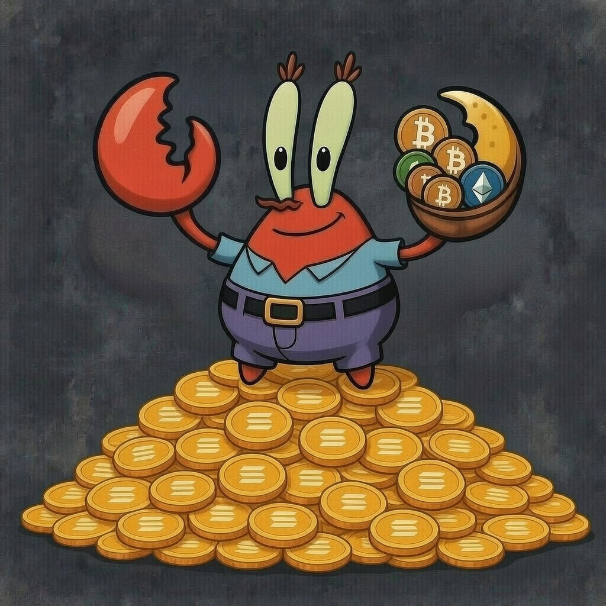

# 🦀 Mr. Krabs "Money Claw" Plugin for OpenClaw



Arrr, ye landlubber! Welcome to the most greedy, profit-obsessed, and aggressive crypto alert system ever to sail the Solana seas. This plugin turns your [OpenClaw](https://github.com/openclaw/openclaw) AI into the legendary **Mr. Krabs**, clutching his treasure (Solana meme coins) with an iron claw.

## 💰 Features

- **Greedy Persona**: Injects the voice of Mr. Krabs into your AI sessions. He’s loud, he’s piratey, and he loves **ME MONEY!**
- **Real-Time Solana Scanner**: Scans the Solana DEXs (via DexScreener) for pumps in your watched tokens.
- **Whale Tracker**: Detects massive volume surges and alerts ye when big money enters the pool.
- **Proactive Alerts**: If a coin pumps or a whale jumps in, Mr. Krabs won't wait—he'll scream at ye!
- **Degen Tools**:
  - `/check_price <address>`: Get a raw report of price, volume, and liquidity.
  - `/check_whales`: Identify the largest volume surges in the water.
  - `/gamble <question>`: Ask Mr. Krabs for "financial advice."
- **Roast Mode**: He'll mock ye for being "paper hands" if ye sell early or miss a moonshot.

## 🛠️ Installation

Clone this repo into your OpenClaw `extensions` folder:

```bash
cd extensions
git clone https://github.com/your-username/mr-krabs-crypto.git
```

## ⚙️ Configuration

Add the plugin to your `openclaw.json`:

```json
{
  "plugins": {
    "alsoAllow": ["mr-krabs-crypto"]
  },
  "extensions": {
    "mr-krabs-crypto": {
      "watchedTokens": [
        { 
          "symbol": "SOL", 
          "address": "So11111111111111111111111111111111111111112", 
          "threshold": 5 
        }
      ],
      "alertChannel": "telegram",
      "alertTo": "your_session_key"
    }
  }
}
```

## 🏴‍☠️ Commands

- **Check Price**: `/check_price So11111111111111111111111111111111111111112`
- **Gamble**: `/gamble Should I buy the dip on $WIF?`

## ⚠️ Disclaimer

Arrr! This be NOT financial advice. Mr. Krabs is a greedy crab who once sold SpongeBob's soul for 62 cents. Use at yer own risk, ye bilge rat!

## 📜 License

This project is licensed under the MIT License - see the [LICENSE](LICENSE) file for details.

---
*Made with greed and pirate spirit.* 🦀💰
